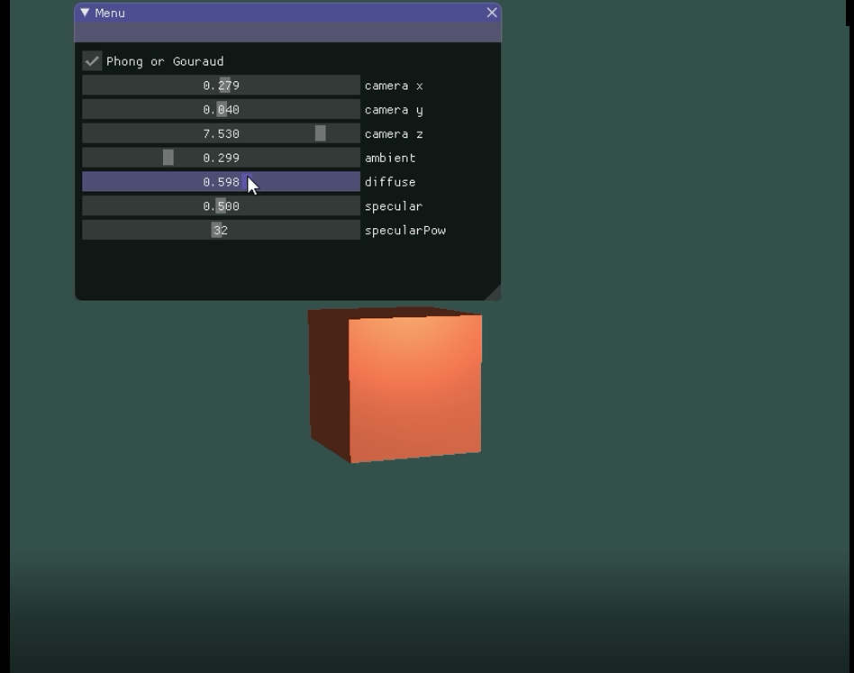
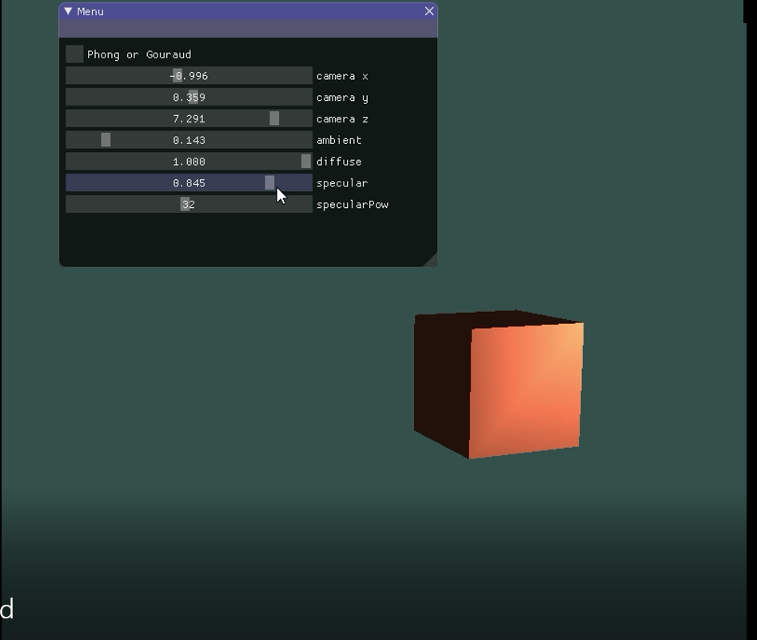

# 计算机图形学第六次作业

```
姓名：刘俊峰
学号：16340150
```

## 要求 

Basic: 
1. 实现Phong光照模型： 场景中绘制一个cube 自己写shader实现两种shading: Phong Shading 和 Gouraud Shading，并解释两种shading的实现原理 合理设置视点、光照位置、光照颜色等参数，使光照效果明显显示
2. 使用GUI，使参数可调节，效果实时更改： GUI里可以切换两种shading 使用如进度条这样的控件，使ambient因子、diffuse因子、specular因子、反光度等参数可调节，光照效 果实时更改 
3. Bonus: 当前光源为静止状态，尝试使光源在场景中来回移动，光照效果实时更改。

## 实验步骤
### 实现Phong光照明模型
Phong光照明模型和Gouraud的区别在于，Phong的光照渲染在片段着色器，即每个pixel都要进行一次光照着色。这次作业实现的光照是局部光照系统，即包含环境光照（ambient），漫反射（diffuse）以及镜面光照反射。着色公式如下: $I(x, y) = I_a * K_a + \sum_{i=0}^{n}(I_i * K_d * (\vec{n} \cdot \vec{l}) + I_i  * K_s * (\vec{n} \cdot \vec{r}) ) $  

根据这个公式构造片段着色器
```glsl
#version 330 core
out vec4 FragColor;

in vec3 Normal;  
in vec3 FragPos;  
  
uniform vec3 lightPos; 
uniform vec3 viewPos; 
uniform vec3 lightColor;
uniform vec3 objectColor;
uniform float ambientStrength;
uniform float specularStrength;
uniform float diffuseStrength;
uniform int specularPow;

void main()
{
    // ambient
    vec3 ambient = ambientStrength * lightColor;
  	
    // diffuse 
    vec3 norm = normalize(Normal);
    vec3 lightDir = normalize(lightPos - FragPos);
    float diff = max(dot(norm, lightDir), 0.0);
    vec3 diffuse = diff * lightColor * diffuseStrength;
    
    // specular
    vec3 viewDir = normalize(viewPos - FragPos);
    vec3 reflectDir = reflect(-lightDir, norm);  
    float spec = pow(max(dot(viewDir, reflectDir), 0.0), specularPow);
    vec3 specular = specularStrength * spec * lightColor;  
        
    vec3 result = (ambient + diffuse + specular) * objectColor;
    FragColor = vec4(result, 1.0);
} 
```
从这里我们可以看到，光源位置，视点位置，光照颜色，物体颜色，环境光照强度，镜面反射强度、反光度、漫反射强度，需要我们设置的。在shader.use之后，像设置model一样，set一下即可。

### 实现Gouraud光照明模型
Gouraud光照和Phong的区别在于，它的光照着色在顶点着色器完成，其他像素的光照信息由顶点插值得到。也就是说，上面的代码需要移动到顶点着色器中完成。

用Gouraud的着色方法可以显著提高渲染效率，毕竟顶点的数目要比像素少得多。然而，插值计算像素光照信息的方法在实现效果上要比直接在像素上计算光照信息要差很多。在实现出来的效果就可见一斑。

### Bonus
使光源移动比较简单。利用第五次作业实现的正方体绕某个点和轴旋转的代码，制作了一个正方体点光源。
```cpp
void Lighting::updateLightPos() {
	double newTime = glfwGetTime();
	if (newTime - currentTime > 0.01) {
		lightPos.x = sin(newTime) * lightRadius;
		lightPos.z = cos(newTime) * lightRadius;
		currentTime = newTime;
	}
}
```

## 实验截图



